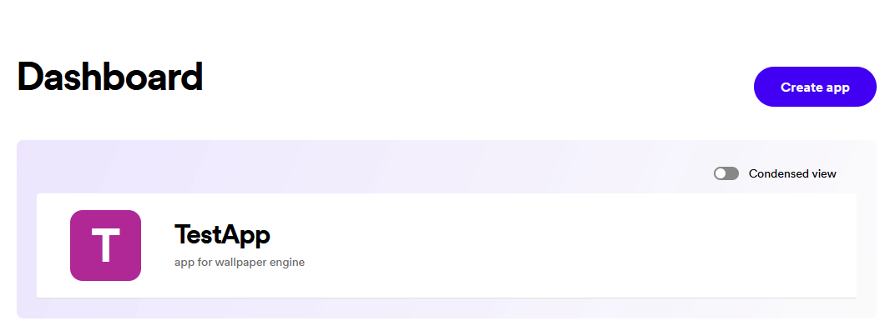
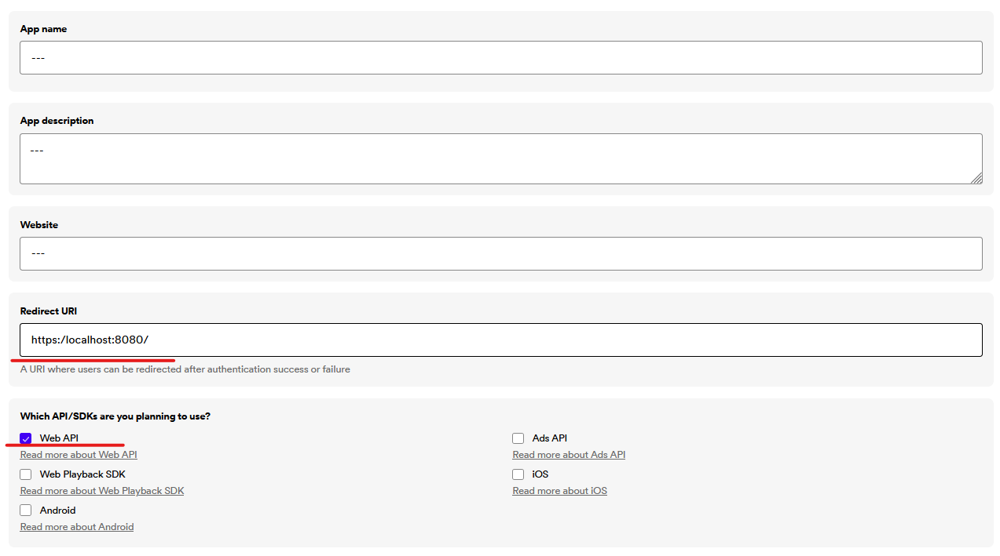
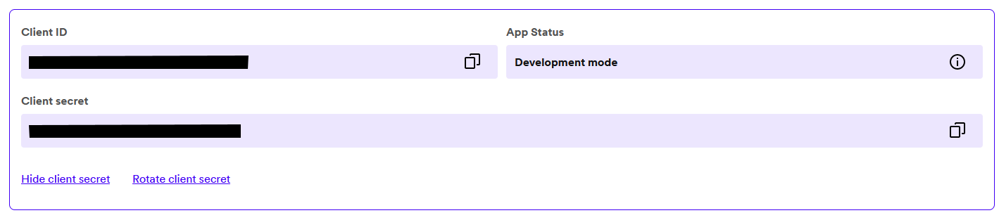

# 
Spotify Widget ofr Windows

---
## Configuration
Open https://developer.spotify.com/, log in, then press on your profile at top-right corner, and select "dashboard".
You should see something like this:
Click "Create app". Make sure you set "Redirect URIs" to http://localhost:8080/ and check "Web API". 
After saving you should see your "Client ID" and "Client Secret"
Copy them to "ClientInfo.ini", then run programm and enjoy😊.
